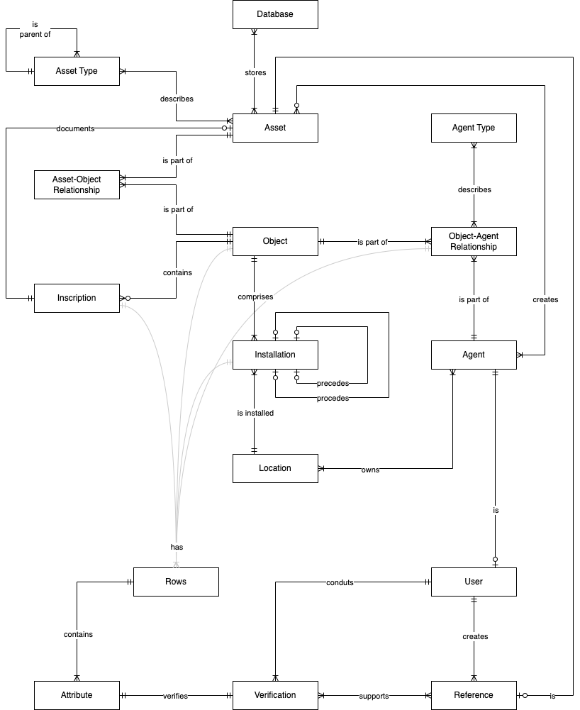

# Design Document

## Scope

The database for Public Art includes all entities necessary to facilitate the documentation of public art. As such, included in the database's scope are:

* Objects, including information on works of art that meet the definition of "public art"
* Installations, including information on the placement of an object on at least one location
* Agents, including information on individuals or groups of individuals that have a relationship to at least one record in at least one entity
* Objects-Agents, including information on the association between object(s) and agent(s)
* Role Types, including information characterizing an object-agent association
* Inscriptions, including information on intentional textual inscription(s) on an object
* Locations, including information on  physical places that have a relationship to at least one record in at least one entity
* Assets, including information on digitized media associated with at least one object
* Asset Types, including information characterizing an asset
* Assets-Objects, including information on the association between asset(s) and object(s)
* Databases, including information on databases where assets are stored
* Assets-Databases, including information on the storage location of digitized copy of an asset
* Rows, including information on a record from select entities
* Attributes, including information on an attribute in a row entity
* Verifications, including information on verification of an attribute entity
* References, including information on sources of information used in a verification entity
* Users, including information on users who can perform CRUD operations on the database

At least in the initial iterations of the database, the following are out of scope:

* The actual assets themselves, since they are to be stored in NoSQL databases.
* Non-factual information about the objects, such as art criticisms, aesthetic interpretations and other forms of opinion writing.
* An object's full provenance. For objects that are temporary installations, the database will only concern itself with information about the installation immediately before and after the current installation, with "current" referring to the installation at the time of its record entry in the database.
* Attributes not selected to undergo a verification process.

## Functional Requirements

This database will support:

* CRUD operations by users
* Tracking assets stored in other databases
* Implementing principle of least privilege
* Verifying select attributes from select entities

Note that the database will not support CRUD operations on the assets, which are saved on other data stores, except on the metadata saved on the database.

## Representation

Entities are captured in Postgres tables with the following schema.

### Entities

The database includes the following entities:

#### Objects

The `objects` table includes:

| Attribute                | Key | Data Type      | Description                                                                 | Default value | Value range           | Example                                                 |
|--------------------------|-----|----------------|-----------------------------------------------------------------------------|---------------|-----------------------|---------------------------------------------------------|
| `id`                     | PK  | `SERIAL`       | Unique identifier of this object record                                     | ''            | > 0                   | 1                                                       |
| `api_id`                 |     | `VARCHAR(13)`  | Public facing unique identifier of this object                              | ''            | > "PADAPI-000000"     | "PADAPI-000001"                                         |
| `title`                  |     | `VARCHAR(256)` | Official name of this object                                                | ''            | ''                    | "Flamingo"                                              |
| `title_display`          |     | `VARCHAR(256)` | Public facing name of this object                                           | null          | ''                    | "Flamingo"                                              |
| `title_alt`              |     | `VARCHAR(256)` | Documented alternative name(s) of this objects                              | null          | ''                    | null                                                    |
| `date_display`           |     | `DATE`         | Public facing year to date this object                                      | null          | -9999 - 9999          | 1974                                                    |
| `medium`                 |     | `TEXT`         | Description of construction material                                        | null          | ''                    | "Sculpture: steel plates, painted; Base pads: granite." |
| `dimensions`             |     | `VARCHAR(256)` | Non-standardized text description of the physical dimensions of this object | null          | ''                    | "1,620 cm (636 in)"                                     |
| `has_inscriptions`       |     | `BOOL`         | Whether object has inscriptions or not                                      | False         | "True, False"         | True                                                    |
| `description`            |     | `TEXT`         | General description of this object                                          | null          | ''                    | "Three quarter-inch-thick steel plates..."              |
| `date_commission`        |     | `DATE`         | Year when order for or authorization for production of object was given     | null          | -9999 - 9999          | null                                                    |
| `date_fabrication_start` |     | `DATE`         | Year when production of object started                                      | null          | -9999 - 9999          | 1973                                                    |
| `date_fabrication_end`   |     | `DATE`         | Year when production of object ended                                        | null          | -9999 - 9999          | 1973                                                    |
| `record_remarks`         |     | `TEXT`         | Remarks associated with the record                                          | null          | -9999 - 9999          | null                                                    |
| `record_date_created`    |     | `TIMESTAMP`    | Date and time the record was created                                        | ''            | > 2024-01-01 12:00:00 | 2024-01-01 12:00:00                                     |
| `record_date_updated`    |     | `TIMESTAMP`    | Date and time the record was edited                                         | null          | > 2024-01-01 12:00:00 | 2024-01-01 12:00:00                                     |

#### Installations

The `installations` table includes:

| Attribute                     | Key | Data Type    | Description                                                                                        | Value range   | Default range         | Example                                                                 |
|-------------------------------|-----|--------------|----------------------------------------------------------------------------------------------------|---------------|-----------------------|-------------------------------------------------------------------------|
| `id`                          | PK  | `SERIAL`     | Unique identifier of the installation                                                              | ''            | > 0                   | 1                                                                       |
| `object_id`                   | FK  | `INTEGER`    | Unique identifier of the object associated with the installation                                   | ''            | > "PADAPI-000000"     | "PADAPI-000001"                                                         |
| `latitude`                    |     | `NUMERIC`    | Latitude coordinate of the centroid of the installation                                            | null          | -90 to 90             | 41.878809                                                               |
| `longitude`                   |     | `NUMERIC`    | Longitude coordinate of the centroid of the installation                                           | null          | -90 to 90             | -87.62968                                                               |
| `location_id`                 | FK  | `INTEGER`    | Unique identifier of the location of the the installation                                          | ''            | > 0                   | 1                                                                       |
| `is_permanent`                |     | `VARCHAR(8)` | Whether the installation is permanent or temporary                                                 | "Tbd"         | "Yes, No, Tbd"        | Yes                                                                     |
| `description`                 |     | `TEXT`       | Description of spatial setting of object at location                                               | null          | ''                    | "Located on the middle south edge of a plaza fronting the post office." |
| `commissioning_entity`        | FK  | `INTEGER`    | Unique identifier of agent who commissioned the installation v. commissioning agent for object     | null          | > 0                   | 2                                                                       |
| `date_assembly_start`         |     | `DATE`       | Start date of post-production assembly for the installation                                        | null          | -9999 - 9999          | 1974                                                                    |
| `data_assembly_end`           |     | `DATE`       | End date of post-production assembly for the installation                                          | null          | -9999 - 9999          | 1974                                                                    |
| `date_display_start_official` |     | `DATE`       | Start date of the installation usually refers to official public dedication                        | null          | -9999 - 9999          | 1974                                                                    |
| `date_display_end_official`   |     | `DATE`       | End date of this installation usually refers to total removal of object from location              | null          | -9999 - 9999          | null                                                                    |
| `installation_pre`            | FK  | `INTEGER`    | Unique identifier of installation immediately prior to the installation associated with the record | null          | > 0                   | null                                                                    |
| `installation_post`           | FK  | `INTEGER`    | Unique identifier of installation immediately after the installation associated with the record    | null          | > 0                   | null                                                                    |
| `record_remarks`              |     | `TEXT`       | Remarks associated with the record                                                                 | null          | ''                    | null                                                                    |
| `record_date_created`         |     | `TIMESTAMP`  | Date and time the record was created                                                               | ''            | > 2024-01-01 12:00:00 | 2024-01-01 12:00:00                                                     |
| `record_date_updated`         |     | `TIMESTAMP`  | Date and time the record was edited                                                                | null          | > 2024-01-01 12:00:00 | 2024-01-01 12:00:00                                                     |

#### Agents

The `agents` table includes:

| Attribute             | Key | Data Type      | Description                                            | Default value | Value range                      | Example             |
|-----------------------|-----|----------------|--------------------------------------------------------|---------------|----------------------------------|---------------------|
| `id`                  | PK  | `SERIAL`       | Unique identifier of the agent                         | ''            | > 0                              | 1                   |
| `agent_type`          |     | `VARCHAR(16)`  | Name of type of agent                                  | "Tbd"         | "Individual, Couple, Group, Tbd" | "Individual"        |
| `name_display`        |     | `VARCHAR(128)` | Pubic facing name of the agent                         | ''            | ''                               | "Alexander Calder"  |
| `name_first`          |     | `VARCHAR(128)` | First name of agent if type is individual              | null          | ''                               | "Alexander"         |
| `name_middle`         |     | `VARCHAR(128)` | Middle name of agent if type is individual             | null          | ''                               | null                |
| `name_last`           |     | `VARCHAR(128)` | Last name of agent if type is individual               | null          | ''                               | "Calder"            |
| `name_alt`            |     | `VARCHAR(128)` | Alternative name(s) of the agent                       | null          | ''                               | null                |
| `nationality`         |     | `VARCHAR(128)` | Nationality associated with the agent                  | null          | ''                               | "United States"     |
| `city`                |     | `VARCHAR(128)` | Full name of the city associated with the agent        | null          | ''                               | "New York"          |
| `country`             |     | `VARCHAR(128)` | Full name of the country associated with the agent     | null          | ''                               | "United States"     |
| `address`             |     | `VARCHAR(128)` | Full postal physical address associated with the agent | null          | ''                               | null                |
| `date_begin`          |     | `DATE`         | Year of start of a time period                         | null          | -9999 - 9999                     | 1898                |
| `date_end`            |     | `DATE`         | Year of end of a time period                           | null          | -9999 - 9999                     | 1976                |
| `record_remarks`      |     | `TEXT`         | Remarks associated with the record                     | null          | ''                               | null                |
| `record_date_created` |     | `TIMESTAMP`    | Date and time the record was created                   | ''            | > 2024-01-01 12:00:00            | 2024-01-01 12:00:00 |
| `record_date_updated` |     | `TIMESTAMP`    | Date and time the record was edited                    | null          | > 2024-01-01 12:00:00            | 2024-01-01 12:00:00 |

#### Role Types

The `role_types` table includes:

| Attribute             | Key | Data Type      | Description                          | Default value | Value range           | Example                           |
|-----------------------|-----|----------------|--------------------------------------|---------------|-----------------------|-----------------------------------|
| `id`                  | PK  | `SERIAL`       | Unique identifier of the agent type  | ''            | > 0                   | 1                                 |
| `name`                |     | `VARCHAR(32)`  | Name of the agent type               | ''            | ''                    | "artist"                          |
| `description`         |     | `VARCHAR(128)` | Description of the agent type        | null          | ''                    | "Lead artistic creator of object" |
| `record_remarks`      |     | `TEXT`         | Remarks associated with the record   | null          | ''                    | null                              |
| `record_date_created` |     | `TIMESTAMP`    | Date and time the record was created | ''            | > 2024-01-01 12:00:00 | 2024-01-01 12:00:00               |
| `record_date_updated` |     | `TIMESTAMP`    | Date and time the record was edited  | null          | > 2024-01-01 12:00:00 | 2024-01-01 12:00:00               |

#### Agent-Object Relationships

The `r_agents_objects` table includes:

| Attribute             | Key | Data Type   | Description                                                                       | Value range   | Default range         | Example             |
|-----------------------|-----|-------------|-----------------------------------------------------------------------------------|---------------|-----------------------|---------------------|
| `id`                  | PK  | `SERIAL`    | Unique identifier of the object-agent relationship                                | ''            | > 0                   | 1                   |
| `object_id`           | FK  | `INTEGER`   | Unique identifier of object associated with the object-agent relationship         | ''            | > 0                   | 1                   |
| `agent_id`            | FK  | `INTEGER`   | Unique identifier of agent associated with the object-agent relationship          | ''            | > 0                   | 1                   |
| `role_id`             | FK  | `INTEGER`   | Unique identifier of the agent role associated with the object-agent relationship | ''            | > 0                   | 1                   |
| `record_remarks`      |     | `TEXT`      | Remarks associated with the record                                                | null          | ''                    | null                |
| `record_date_created` |     | `TIMESTAMP` | Date and time the record was created                                              | ''            | > 2024-01-01 12:00:00 | 2024-01-01 12:00:00 |
| `record_date_updated` |     | `TIMESTAMP` | Date and time the record was edited                                               | null          | > 2024-01-01 12:00:00 | 2024-01-01 12:00:00 |

#### Inscriptions

The `inscriptions` table includes:

| Attribute             | Key | Data Type     | Description                                                        | Default value | Value range           | Example                          |
|-----------------------|-----|---------------|--------------------------------------------------------------------|---------------|-----------------------|----------------------------------|
| `id`                  | PK  | `SERIAL`      | Unique identifier of this inscription record                       | ''            | > 0                   | 1                                |
| `object_id`           | FK  | `INTEGER`     | Unique identifier of agent who conducted audit                     | ''            | > 0                   | 1                                |
| `inscription`         |     | `TEXT`        | Transcription of text intended to be integral part of the object   | ''            | ''                    | "(artist monogram)\n73"          |
| `inscription_visual`  | FK  | `INTEGER`     | Unique identifier of the asset documenting the inscription in situ | ''            | > 0                   | 1                                |
| `is_signature`        |     | `VARCHAR(8)`  | Whether or not inscription is the artist signature                 | "Tbd"         | "Yes, No, Tbd"        | "Yes"                            |
| `dimension_width`     |     | `INTEGER`     | Width of the inscription area                                      | null          | ''                    | null                             |
| `dimension_height`    |     | `INTEGER`     | Height of the inscription area                                     | null          | ''                    | null                             |
| `dimension_label`     |     | `VARCHAR(16)` | Unit of measure of dimensions                                      | null          | ''                    | null                             |
| `location`            |     | `TEXT`        | Text describing the location of the inscription                    | null          | ''                    | "Center left of north west side" |
| `record_remarks`      |     | `TEXT`        | Remarks associated with the record                                 | null          | ''                    | null                             |
| `record_date_created` |     | `TIMESTAMP`   | Date and time the record was created                               | ''            | > 2024-01-01 12:00:00 | 2024-01-01 12:00:00              |
| `record_date_updated` |     | `TIMESTAMP`   | Date and time the record was edited                                | null          | > 2024-01-01 12:00:00 | 2024-01-01 12:00:00              |

#### Locations

The `locations` table includes:

| Attribute             | Key | Data Type      | Description                                                            | Default value | Value range           | Example                            |
|-----------------------|-----|----------------|------------------------------------------------------------------------|---------------|-----------------------|------------------------------------|
| `id`                  | PK  | `SERIAL`       | Unique identifier of the location                                      | ''            | > 0                   | 1                                  |
| `name`                |     | `VARCHAR(128)` | Official full name of the location                                     | ''            | ''                    | "Chicago Federal Center"           |
| `name_display`        |     | `VARCHAR(128)` | Public facing name of the location                                     | ''            | ''                    | "Chicago Federal Center"           |
| `name_alt`            |     | `VARCHAR(128)` | Alternative name of the location                                       | null          | ''                    | null                               |
| `centroid_lat`        |     | `NUMERIC`      | Latitude coordinate of the polygon shapefile centroid of the location  | null          | -90 to 90             | 41.879057                          |
| `centroid_lng`        |     | `NUMERIC`      | Longitude coordinate of the polygon shapefile centroid of the location | null          | -90 to 90             | -87.62965                          |
| `city`                |     | `VARCHAR(128)` | Full name of the city of the location                                  | null          | ''                    | "Chicago"                          |
| `country`             |     | `VARCHAR(128)` | Full name of the country of the location                               | null          | ''                    | "United States"                    |
| `address`             |     | `VARCHAR(128)` | Full physical address of the location                                  | null          | ''                    | "219 S Dearborn St Chicago IL USA" |
| `owner_id`            | FK  | `INTEGER`      | Unique identifier of agent who is the owner on record of this location | ''            | > 0                   | 2                                  |
| `record_remarks`      |     | `TEXT`         | Remarks associated with the record                                     | null          | ''                    | null                               |
| `record_date_created` |     | `TIMESTAMP`    | Date and time the record was created                                   | ''            | > 2024-01-01 12:00:00 | 2024-01-01 12:00:00                |
| `record_date_updated` |     | `TIMESTAMP`    | Date and time the record was edited                                    | null          | > 2024-01-01 12:00:00 | 2024-01-01 12:00:00                |

#### Assets

The `assets` table includes:

| Attribute             | Key | Data Type      | Description                                                           | Default value | Value range           | Example                                    |
|-----------------------|-----|----------------|-----------------------------------------------------------------------|---------------|-----------------------|--------------------------------------------|
| `id`                  | PK  | `SERIAL`       | Unique identifier of the asset                                        | ''            | > 0                   | 1                                          |
| `asset_name`          |     | `VARCHAR(128)` | File name of the asset                                                | ''            | ''                    | "calder_flamingo.png"                      |
| `asset_name_display`  |     | `VARCHAR(128)` | Public facing display name of the asset                               | null          | ''                    | "Flamingo"                                 |
| `asset_label`         |     | `TEXT`         | Public facing display label of the asset                              | null          | ''                    | "Flamingo by Alexander Calder"             |
| `asset_type`          | FK  | `INTEGER`      | Unique identifier of the type of the asset                            | ''            | > 0                   | "image"                                    |
| `asset_type_sub`      | FK  | `INTEGER`      | Unique identifier of the type format of the asset                     | ''            | > 0                   | "png"                                      |
| `asset_description`   |     | `TEXT`         | Text description of the asset                                         | null          | ''                    | "An image of Flamingo by Alexander Calder" |
| `asset_content`       |     | `TEXT`         | Text to describe content of the asset to people with low or no vision | null          | ''                    | null                                       |
| `asset_agent_id`      | FK  | `INTEGER`      | Unique identifier of agent who created the asset                      | ''            | > 0                   | 3                                          |
| `asset_copyright`     |     | `VARCHAR(128)` | Public facing copyright notice of the asset                           | null          | ''                    | "CC BY-NC-SA 4.0"                          |
| `asset_date_created`  |     | `DATE`         | Date the asset was created                                            | null          | -9999 - 9999          | 2024-01-01                                 |
| `asset_date_acquired` |     | `DATE`         | Date the asset was acquired from source agent                         | null          | -9999 - 9999          | 2024-01-01                                 |
| `asset_size`          |     | `VARCHAR(16)`  | Description of the size of the digitized on the database              | null          | ''                    | "100 MB"                                   |
| `record_remarks`      |     | `TEXT`         | Remarks associated with the record                                    | null          | ''                    | null                                       |
| `record_date_created` |     | `TIMESTAMP`    | Date and time the record was created                                  | ''            | > 2024-01-01 12:00:00 | 2024-01-01 12:00:00                        |
| `record_date_updated` |     | `TIMESTAMP`    | Date and time the record was edited                                   | null          | > 2024-01-01 12:00:00 | 2024-01-01 12:00:00                        |

#### Asset Types

The `asset_type` table includes:

| Attribute             | Key | Data Type      | Description                                                   | Default value | Value range           | Example             |
|-----------------------|-----|----------------|---------------------------------------------------------------|---------------|-----------------------|---------------------|
| `id`                  | PK  | `SERIAL`       | Unique identifier of the asset type                           | ''            | > 0                   | 1                   |
| `name`                |     | `VARCHAR(128)` | Name of the asset type                                        | ''            | ''                    | "image"             |
| `description`         |     | `VARCHAR(128)` | Description of the asset type                                 | ''            | ''                    | "Photograph"        |
| `is_subtype_of`       | FK  | `INTEGER`      | Unique identifier of the asset type to which it is a child of | ''            | > 0                   | 1                   |
| `record_remarks`      |     | `TEXT`         | Remarks associated with the record                            | null          | ''                    | null                |
| `record_date_created` |     | `TIMESTAMP`    | Date and time the record was created                          | ''            | > 2024-01-01 12:00:00 | 2024-01-01 12:00:00 |
| `record_date_updated` |     | `TIMESTAMP`    | Date and time the record was edited                           | null          | > 2024-01-01 12:00:00 | 2024-01-01 12:00:00 |

#### Asset-Object Relationships

The `r_assets_objects` table includes:

| Attribute             | Key | Data Type   | Description                                                      | Default value | Value range           | Example             |
|-----------------------|-----|-------------|------------------------------------------------------------------|---------------|-----------------------|---------------------|
| `id`                  | PK  | `SERIAL`    | Unique identifier of the asset-object relationship               | ''            | > 0                   | 1                   |
| `asset_id`            | FK  | `INTEGER`   | Unique identifier of the asset in the asset-object relationship  | ''            | > 0                   | 1                   |
| `object_id`           | FK  | `INTEGER`   | Unique identifier of the object in the asset-object relationship | ''            | > 0                   | 1                   |
| `record_remarks`      |     | `TEXT`      | Remarks associated with the record                               | null          | ''                    | null                |
| `record_date_created` |     | `TIMESTAMP` | Date and time the record was created                             | ''            | > 2024-01-01 12:00:00 | 2024-01-01 12:00:00 |
| `record_date_updated` |     | `TIMESTAMP` | Date and time the record was edited                              | null          | > 2024-01-01 12:00:00 | 2024-01-01 12:00:00 |

#### Databases

The `databases` table includes:

| Attribute             | Key | Data Type     | Description                          | Default value | Value range           | Example             |
|-----------------------|-----|---------------|--------------------------------------|---------------|-----------------------|---------------------|
| `id`                  | PK  | `SERIAL`      | Unique identifier of this entity     | ''            | > 0                   | 1                   |
| `name`                |     | `VARCHAR(32)` | Name of the database instance        | ''            | ''                    | "padapi"            |
| `host`                |     | `VARCHAR(32)` | Name of the provider of the database | ''            | ''                    | "AWS"               |
| `type`                |     | `VARCHAR(32)` | Type of the database                 | ''            | ''                    | "Relational"        |
| `type_sub`            |     | `VARCHAR(32)` | Subtype of the database              | ''            | ''                    | "PostgreSQL"        |
| `record_remarks`      |     | `TEXT`        | Remarks associated with the record   | null          | ''                    | null                |
| `record_date_created` |     | `TIMESTAMP`   | Date and time the record was created | ''            | > 2024-01-01 12:00:00 | 2024-01-01 12:00:00 |
| `record_date_updated` |     | `TIMESTAMP`   | Date and time the record was edited  | null          | > 2024-01-01 12:00:00 | 2024-01-01 12:00:00 |

#### Asset-Database Relationships

The `r_assets_databases` table includes:

| Attribute             | Key | Data Type   | Description                                                             | Default value | Value range           | Example             |
|-----------------------|-----|-------------|-------------------------------------------------------------------------|---------------|-----------------------|---------------------|
| `id`                  | PK  | `SERIAL`    | Unique identifier of the document-database relationship                 | ''            | > 0                   | 1                   |
| `document_id`         | FK  | `INTEGER`   | Unique identifier of the document in the document-database relationship | ''            | > 0                   | 1                   |
| `database_id`         | FK  | `INTEGER`   | Unique identifier of the database in the document-database relationship | ''            | > 0                   | 1                   |
| `record_remarks`      |     | `TEXT`      | Remarks associated with the record                                      | null          | ''                    | null                |
| `record_date_created` |     | `TIMESTAMP` | Date and time the record was created                                    | ''            | > 2024-01-01 12:00:00 | 2024-01-01 12:00:00 |
| `record_date_updated` |     | `TIMESTAMP` | Date and time the record was edited                                     | null          | > 2024-01-01 12:00:00 | 2024-01-01 12:00:00 |

#### Rows

| Attribute             | Key | Data Type     | Description                                      | Default value | Value range           | Example             |
|-----------------------|-----|---------------|--------------------------------------------------|---------------|-----------------------|---------------------|
| `id`                  | PK  | `SERIAL`      | Unique identifier of the row                     | ''            | > 0                   | 1                   |
| `table`               |     | `VARCHAR(32)` | Name of the source table of the row              | ''            | ''                    | "objects"           |
| `table_row`           | FK  | `INTEGER`     | Unique identifier of the row at the source table | ''            | > 0                   | 1                   |
| `record_date_created` |     | `TIMESTAMP`   | Date and time the record was created             | ''            | > 2024-01-01 12:00:00 | 2024-01-01 12:00:00 |
| `record_date_updated` |     | `TIMESTAMP`   | Date and time the record was edited              | null          | > 2024-01-01 12:00:00 | 2024-01-01 12:00:00 |

#### Attributes

| Attribute             | Key | Data Type     | Description                          | Default value | Value range           | Example             |
|-----------------------|-----|---------------|--------------------------------------|---------------|-----------------------|---------------------|
| `id`                  | PK  | `SERIAL`      | Unique identifier of the attribute   | ''            | > 0                   | 1                   |
| `column_name`         |     | `VARCHAR(32)` | Name of the attribute                | ''            | ''                    | "dimensions"        |
| `column_type`         |     | `VARCHAR(32)` | Date type of attribute               | ''            | ''                    | "VARCHAR(256)"      |
| `column_value`        |     | `TEXT`        | Value of the attribute               | ''            | ''                    | "1,620 cm (636 in)" |
| `record_date_created` |     | `TIMESTAMP`   | Date and time the record was created | ''            | > 2024-01-01 12:00:00 | 2024-01-01 12:00:00 |
| `record_date_updated` |     | `TIMESTAMP`   | Date and time the record was edited  | null          | > 2024-01-01 12:00:00 | 2024-01-01 12:00:00 |

#### Verifications

| Attribute             | Key | Data Type     | Description                                                         | Default value | Value range           | Example             |
|-----------------------|-----|---------------|---------------------------------------------------------------------|---------------|-----------------------|---------------------|
| `id`                  | PK  | `SERIAL`      | Unique identifier of the verification                               | ''            | > 0                   | 1                   |
| `column_id`           | FK  | `INTEGER`     | Unique identifier of column                                         | ''            | > 0                   | 1                   |
| `reference_id`        | FK  | `INTEGER`     | Unique identifier of the reference associated with the verification | ''            | > 0                   | 1                   |
| `reference_page`      |     | `VARCHAR(16)` | Page(s) of the reference used for the verification                  | null          | ''                    | "54-55"             |
| `user_id`             | FK  | `INTEGER`     | Unique identifier of the user who conducted verification            | ''            | > 0                   | 1                   |
| `date_verification`   |     | `TIMESTAMP`   | Public facing date when verification was conducted                  | ''            | > 2024-01-01 12:00:00 | 2024-01-01          |
| `record_remarks`      |     | `TEXT`        | Remarks associated with the record                                  | null          | ''                    | null                |
| `record_date_created` |     | `TIMESTAMP`   | Date and time the record was created                                | ''            | > 2024-01-01 12:00:00 | 2024-01-01 12:00:00 |
| `record_date_updated` |     | `TIMESTAMP`   | Date and time the record was edited                                 | null          | > 2024-01-01 12:00:00 | 2024-01-01 12:00:00 |

#### References

| Attribute             | Key | Data Type     | Description                                              | Default value | Value range           | Example                                                                                                           |
|-----------------------|-----|---------------|----------------------------------------------------------|---------------|-----------------------|-------------------------------------------------------------------------------------------------------------------|
| `id`                  | PK  | `SERIAL`      | Unique identifier of the reference                       | ''            | > 0                   | 1                                                                                                                 |
| `citation`            |     | `TEXT`        | Full citation of the reference in the APA format         | ''            | ''                    | "Bach, I. J., & Gray, M. L. (1983). A Guide to Chicago's Public Sculpture. Chicago: University of Chicago Press." |
| `isbn`                |     | `VARCHAR(16)` | 13-digit identifier of the reference                     | null          | ''                    | "9780226033983"                                                                                                   |
| `asset_id`            | FK  | `INTEGER`     | Unique identifier of asset associated with the reference | null          | > 0                   | null                                                                                                              |
| `record_remarks`      |     | `TEXT`        | Remarks associated with the record                       | null          | ''                    | null                                                                                                              |
| `record_date_created` |     | `TIMESTAMP`   | Date and time the record was created                     | ''            | > 2024-01-01 12:00:00 | 2024-01-01 12:00:00                                                                                               |
| `record_date_updated` |     | `TIMESTAMP`   | Date and time the record was edited                      | null          | > 2024-01-01 12:00:00 | 2024-01-01 12:00:00                                                                                               |

#### Users

| Attribute             | Key | Data Type                | Description                                         | Default value | Value range               | Example             |
|-----------------------|-----|--------------------------|-----------------------------------------------------|---------------|---------------------------|---------------------|
| `id`                  | PK  | `SERIAL`                 | Unique identifier of the user                       | ''            | > 0                       | 1                   |
| `name_first`          |     | `VARCHAR(64)`            | First name of the user                              | null          | ''                        | "Alex"              |
| `name_last`           |     | `VARCHAR(64)`            | Last name of the user                               | null          | ''                        | "Colder"            |
| `username`            |     | `VARCHAR(16)`            | Username of the user                                | ''            | ''                        | "alex"              |
| `hash`                |     | `VARCHAR(128)`           | Hashed password                                     | ''            | ''                        | "##########"        |
| `role`                |     | `VARCHAR(16)`            | Name of user role                                   | "default"     | "admin, curator, default" | "admin"             |
| `agent_id`            | FK  | `INTEGER`                | Unique identifier of agent if user is also an agent | null          | > 0                       | 3                   |
| `record_date_created` |     | `ISO 8601 date and time` | Date and time the record was created                | ''            | > 2024-01-01 12:00:00     | 2024-01-01 12:00:00 |
| `record_date_updated` |     | `ISO 8601 date and time` | Date and time the record was edited                 | null          | > 2024-01-01 12:00:00     | 2024-01-01 12:00:00 |

### Relationships

The below entity relationship diagram describes the relationships among the entities in the database.

As detailed by the diagram, here are the most important relationships:

* One object, which refers to a work of art, including all its constituent parts, is part of one to many installations. An installation is comprised of one and only one object.
* An installation is installed in one and only one location. A location contains zero to many installations.
* An installation is preceded by zero to one installation. Similarly, an installation is proceeded by zero to one installation.
* An object is part of one to many object-agent relationship. Similarly, an agent is part of one to many object-agent relationship. An example object-agent relationship is an agent being the lead artistic creator of an object. Another example is an agent being the owner of record for an object.
* An object contains zero to many inscriptions. An inscription is contained in one and only one object.
* An asset is in one to many asset-object relationships. Similarly, an object is in zero to many asset-object relationships. An example asset-object is a video showing an object at an installation.
* The entities object, installation, inscription and object-agent relationship has one to many rows. In practical terms, this means that all their rows have metadata saved on the rows entity.
* A row contains one to many attributes. An attribute is in one and only one row.
* A verification verifies one and only one attribute. An attribute is verified by one and only one verification.
* A reference supports one to many verifications. A verification is supported by one to many references.

## Optimizations

Per the typical queries in `queries.sql`, it is common for users of the database to view records of an object and its current installation. For that reason, indexes are created on the `title`, `title_display` and `title_alt` columns in the `objects` table to speed the identification of objects by those columns.

For that same reason, indexes are also created on the `name`, `name_display` and `name_alt` columns in the `locations` table.

## Limitations

The current schema assumes that an attribute will only need one verification by one user. In other words, it assumes that the user who conducted the verification will have 100% accuracy. If verification requires double checking, then both the attribute-verification and verification-user relationships will have to be many-to-many.

The current schema also assumes that (spatially and/or temporally) separated or separable parts of a work of art (i.e., object) are in an inseparable relationship with each other. In other words, the database assumes all those parts to be an integral part of the object. They may have individual titles, but they do not have their own identify or function independently from the object. Thus, the schema cannot support an object made up of individual items which may be displayed separately in different settings or time by the artist.
